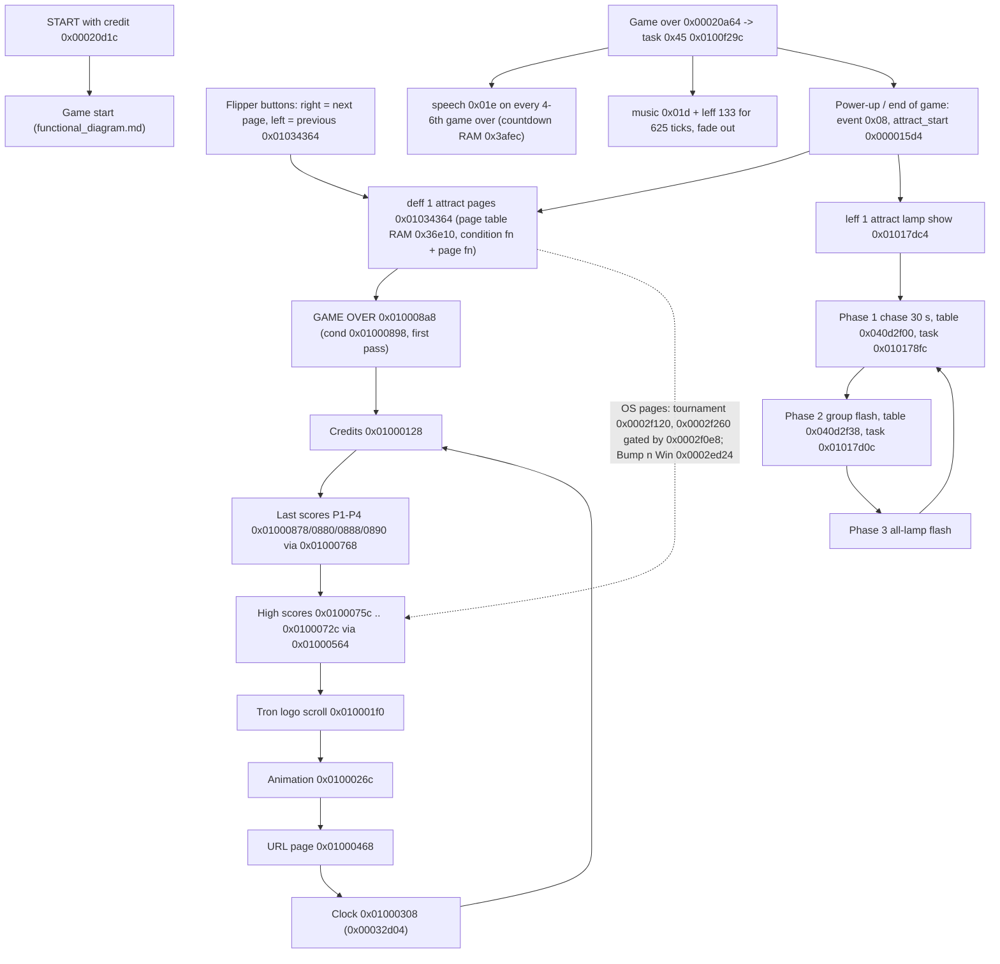

# Flow: attract mode and game-over show (spec `rules/modes/attract_and_service.md`)

```mermaid
flowchart TD
  PU["Power-up / end of game: event 0x08, attract_start 0x000015d4"] --> D1["deff 1 attract pages 0x01034364 (page table RAM 0x36e10, condition fn + page fn)"]
  PU --> LE["leff 1 attract lamp show 0x01017dc4"]
  LE --> L1["Phase 1 chase 30 s, table 0x040d2f00, task 0x010178fc"] --> L2["Phase 2 group flash, table 0x040d2f38, task 0x01017d0c"] --> L3["Phase 3 all-lamp flash"] --> L1
  D1 --> P1["GAME OVER 0x010008a8 (cond 0x01000898, first pass)"] --> P2["Credits 0x01000128"]
  P2 --> P3["Last scores P1-P4 0x01000878/0880/0888/0890 via 0x01000768"]
  P3 --> P4["High scores 0x0100075c .. 0x0100072c via 0x01000564"]
  P4 --> P5["Tron logo scroll 0x010001f0"] --> P6["Animation 0x0100026c"] --> P7["URL page 0x01000468"] --> P8["Clock 0x01000308 (0x00032d04)"] --> P2
  D1 -.->|"OS pages: tournament 0x0002f120, 0x0002f260 gated by 0x0002f0e8; Bump n Win 0x0002ed24"| P4
  FB["Flipper buttons: right = next page, left = previous 0x01034364"] --> D1
  ST["START with credit 0x00020d1c"] --> G["Game start (functional_diagram.md)"]
  GO["Game over 0x00020a64 -> task 0x45 0x0100f29c"] --> S1["speech 0x01e on every 4-6th game over (countdown RAM 0x3afec)"]
  GO --> S2["music 0x01d + leff 133 for 625 ticks, fade out"]
  GO --> PU
```
