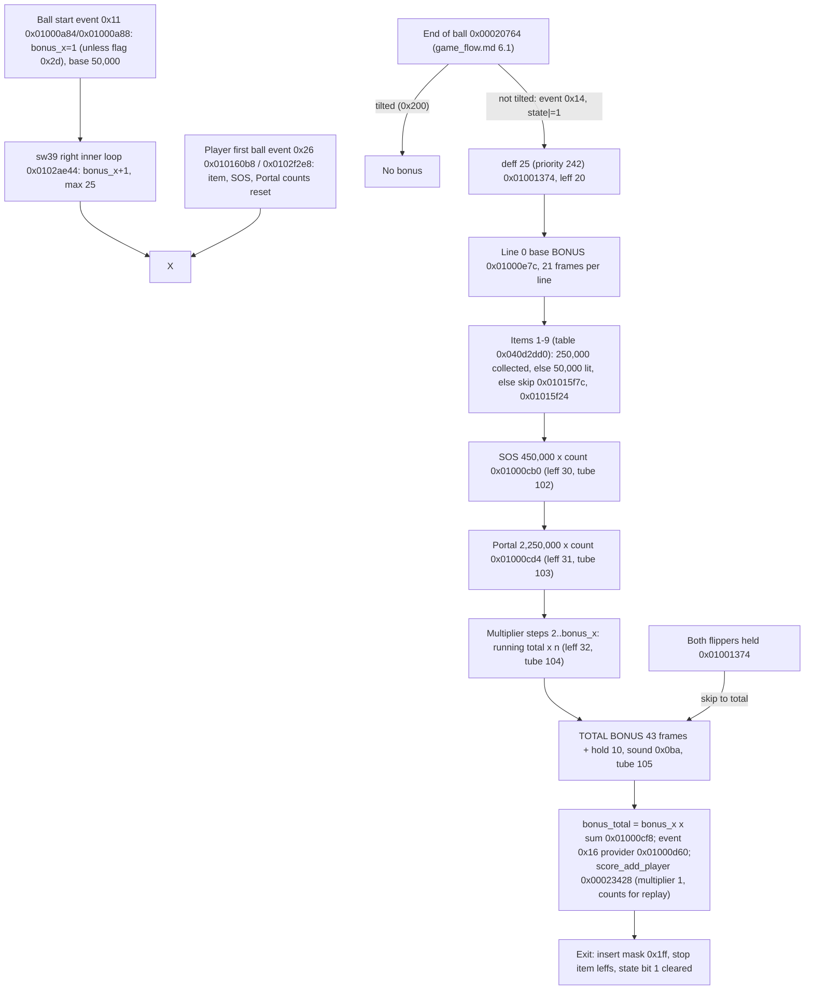

# Flow: end-of-ball bonus (spec `rules/modes/bonus.md`)

```mermaid
flowchart TD
  BS["Ball start event 0x11 0x01000a84/0x01000a88: bonus_x=1 (unless flag 0x2d), base 50,000"] --> M
  M["sw39 right inner loop 0x0102ae44: bonus_x+1, max 25"] --> X
  P1["Player first ball event 0x26 0x010160b8 / 0x0102f2e8: item, SOS, Portal counts reset"] --> X
  EB["End of ball 0x00020764 (game_flow.md 6.1)"] -->|"tilted (0x200)"| NO["No bonus"]
  EB -->|"not tilted: event 0x14, state|=1"| D["deff 25 (priority 242) 0x01001374, leff 20"]
  D --> L0["Line 0 base BONUS 0x01000e7c, 21 frames per line"]
  L0 --> LI["Items 1-9 (table 0x040d2dd0): 250,000 collected, else 50,000 lit, else skip 0x01015f7c, 0x01015f24"]
  LI --> LS["SOS 450,000 x count 0x01000cb0 (leff 30, tube 102)"]
  LS --> LP["Portal 2,250,000 x count 0x01000cd4 (leff 31, tube 103)"]
  LP --> LX["Multiplier steps 2..bonus_x: running total x n (leff 32, tube 104)"]
  LX --> LT["TOTAL BONUS 43 frames + hold 10, sound 0x0ba, tube 105"]
  FK["Both flippers held 0x01001374"] -->|"skip to total"| LT
  LT --> ADD["bonus_total = bonus_x x sum 0x01000cf8; event 0x16 provider 0x01000d60;<br/>score_add_player 0x00023428 (multiplier 1, counts for replay)"]
  ADD --> EX["Exit: insert mask 0x1ff, stop item leffs, state bit 1 cleared"]
```
