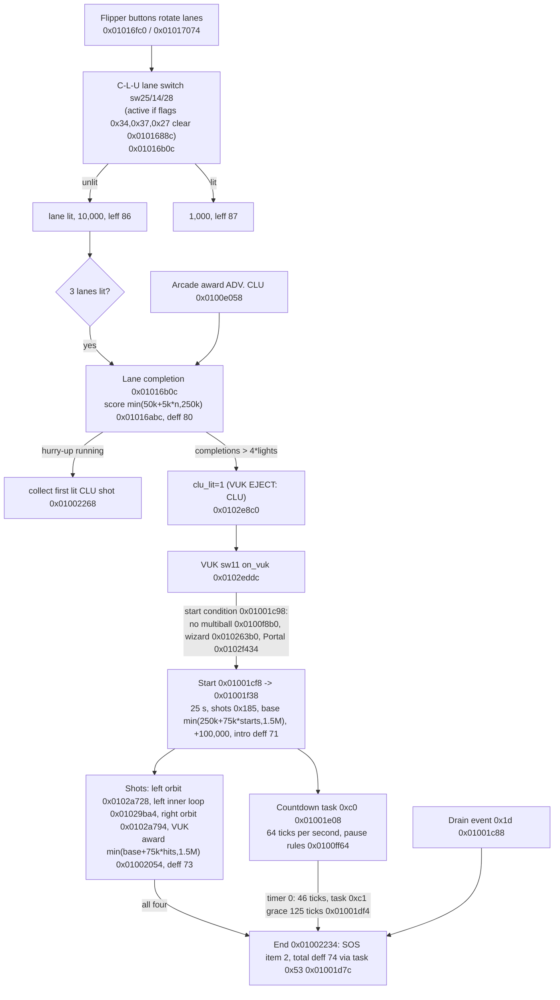

# Flow: CLU hurry-up (spec `rules/modes/clu_hurryup.md`)

```mermaid
flowchart TD
  L["C-L-U lane switch sw25/14/28<br/>(active if flags 0x34,0x37,0x27 clear 0x0101688c)<br/>0x01016b0c"] -->|"unlit"| L1["lane lit, 10,000, leff 86"]
  L -->|"lit"| L2["1,000, leff 87"]
  L1 --> LC{"3 lanes lit?"}
  LC -->|"yes"| COMP["Lane completion 0x01016b0c<br/>score min(50k+5k*n,250k) 0x01016abc, deff 80"]
  FL["Flipper buttons rotate lanes<br/>0x01016fc0 / 0x01017074"] --> L
  COMP -->|"hurry-up running"| CA["collect first lit CLU shot 0x01002268"]
  COMP -->|"completions > 4*lights"| LIT["clu_lit=1 (VUK EJECT: CLU)<br/>0x0102e8c0"]
  AR["Arcade award ADV. CLU 0x0100e058"] --> COMP
  LIT --> V["VUK sw11 on_vuk 0x0102eddc"]
  V -->|"start condition 0x01001c98:<br/>no multiball 0x0100f8b0, wizard 0x010263b0, Portal 0x0102f434"| ST["Start 0x01001cf8 -> 0x01001f38<br/>25 s, shots 0x185, base min(250k+75k*starts,1.5M), +100,000, intro deff 71"]
  ST --> TK["Countdown task 0xc0 0x01001e08<br/>64 ticks per second, pause rules 0x0100ff64"]
  ST --> SH["Shots: left orbit 0x0102a728, left inner loop 0x01029ba4, right orbit 0x0102a794, VUK<br/>award min(base+75k*hits,1.5M) 0x01002054, deff 73"]
  SH -->|"all four"| END
  TK -->|"timer 0: 46 ticks, task 0xc1 grace 125 ticks 0x01001df4"| END["End 0x01002234: SOS item 2, total deff 74 via task 0x53 0x01001d7c"]
  D["Drain event 0x1d 0x01001c88"] --> END
```
