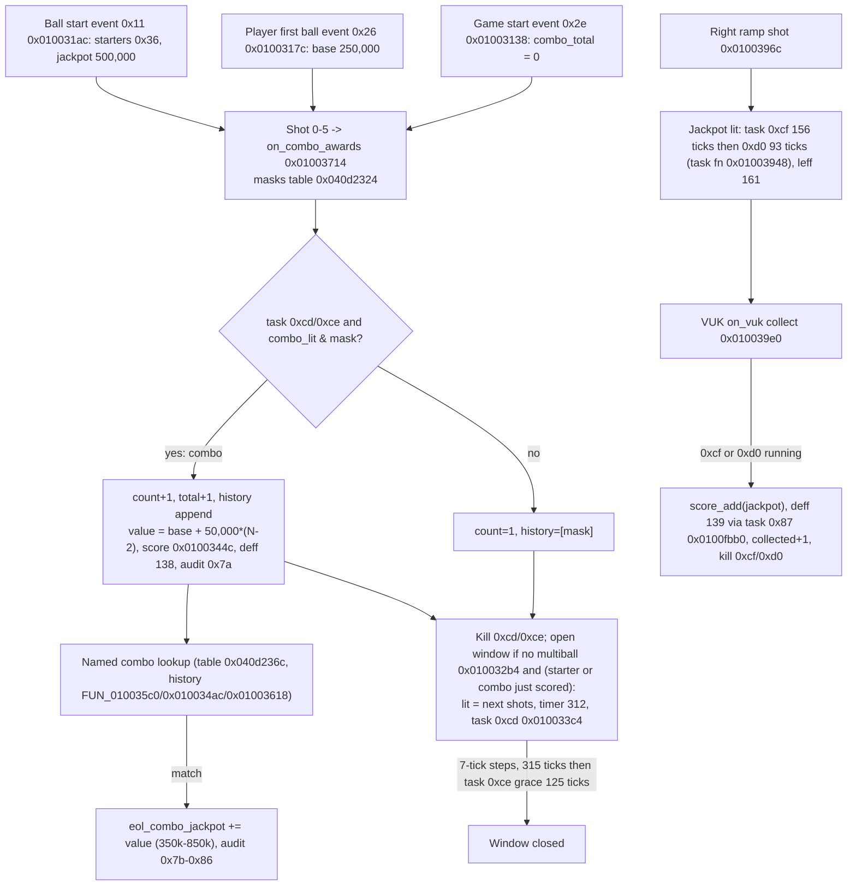

# Flow: combos and End of Line combo jackpot (spec `rules/modes/combos.md`)

```mermaid
flowchart TD
  BS["Ball start event 0x11 0x010031ac: starters 0x36, jackpot 500,000"] --> SH
  P1["Player first ball event 0x26 0x0100317c: base 250,000"] --> SH
  G["Game start event 0x2e 0x01003138: combo_total = 0"] --> SH
  SH["Shot 0-5 -> on_combo_awards 0x01003714<br/>masks table 0x040d2324"] --> T{"task 0xcd/0xce and combo_lit & mask?"}
  T -->|"yes: combo"| C["count+1, total+1, history append<br/>value = base + 50,000*(N-2), score 0x0100344c, deff 138, audit 0x7a"]
  T -->|"no"| N["count=1, history=[mask]"]
  C --> NC["Named combo lookup (table 0x040d236c, history FUN_010035c0/0x010034ac/0x01003618)"]
  NC -->|"match"| J["eol_combo_jackpot += value (350k-850k), audit 0x7b-0x86"]
  C --> W
  N --> W["Kill 0xcd/0xce; open window if no multiball 0x010032b4 and (starter or combo just scored):<br/>lit = next shots, timer 312, task 0xcd 0x010033c4"]
  W -->|"7-tick steps, 315 ticks then task 0xce grace 125 ticks"| X["Window closed"]
  RR["Right ramp shot 0x0100396c"] --> JL["Jackpot lit: task 0xcf 156 ticks then 0xd0 93 ticks (task fn 0x01003948), leff 161"]
  V["VUK on_vuk collect 0x010039e0"] -->|"0xcf or 0xd0 running"| JS["score_add(jackpot), deff 139 via task 0x87 0x0100fbb0, collected+1, kill 0xcf/0xd0"]
  JL --> V
```
