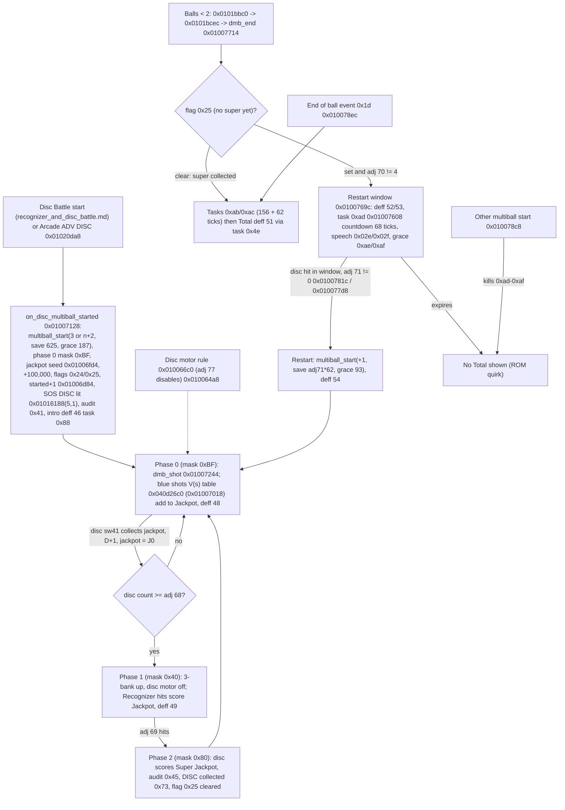

# Flow: Disc Multiball (spec `rules/modes/disc_multiball.md`, code 0x01006d00-0x01009c00)

```mermaid
flowchart TD
  DB["Disc Battle start (recognizer_and_disc_battle.md) or Arcade ADV DISC 0x01020da8"] --> ST["on_disc_multiball_started 0x01007128:<br/>multiball_start(3 or n+2, save 625, grace 187), phase 0 mask 0xBF, jackpot seed 0x01006fd4,<br/>+100,000, flags 0x24/0x25, started+1 0x01006d84, SOS DISC lit 0x01016188(5,1), audit 0x41, intro deff 46 task 0x88"]
  ST --> P0["Phase 0 (mask 0xBF): dmb_shot 0x01007244; blue shots V(s) table 0x040d26c0 (0x01007018) add to Jackpot, deff 48"]
  P0 -->|"disc sw41 collects jackpot, D+1, jackpot = J0"| C{"disc count >= adj 68?"}
  C -->|"no"| P0
  C -->|"yes"| P1["Phase 1 (mask 0x40): 3-bank up, disc motor off; Recognizer hits score Jackpot, deff 49"]
  P1 -->|"adj 69 hits"| P2["Phase 2 (mask 0x80): disc scores Super Jackpot, audit 0x45, DISC collected 0x73, flag 0x25 cleared"]
  P2 --> P0
  MOT["Disc motor rule 0x010066c0 (adj 77 disables) 0x010064a8"] -.-> P0
  EN["Balls < 2: 0x0101bbc0 -> 0x0101bcec -> dmb_end 0x01007714"] --> F{"flag 0x25 (no super yet)?"}
  F -->|"clear: super collected"| T1["Tasks 0xab/0xac (156 + 62 ticks) then Total deff 51 via task 0x4e"]
  F -->|"set and adj 70 != 4"| RW["Restart window 0x0100769c: deff 52/53, task 0xad 0x01007608 countdown 68 ticks, speech 0x02e/0x02f, grace 0xae/0xaf"]
  RW -->|"disc hit in window, adj 71 != 0 0x0100781c / 0x010077d8"| RS["Restart: multiball_start(+1, save adj71*62, grace 93), deff 54"]
  RS --> P0
  RW -->|"expires"| X["No Total shown (ROM quirk)"]
  EB["End of ball event 0x1d 0x010078ec"] --> T1
  MB["Other multiball start 0x010078c8"] -->|"kills 0xad-0xaf"| X
```
