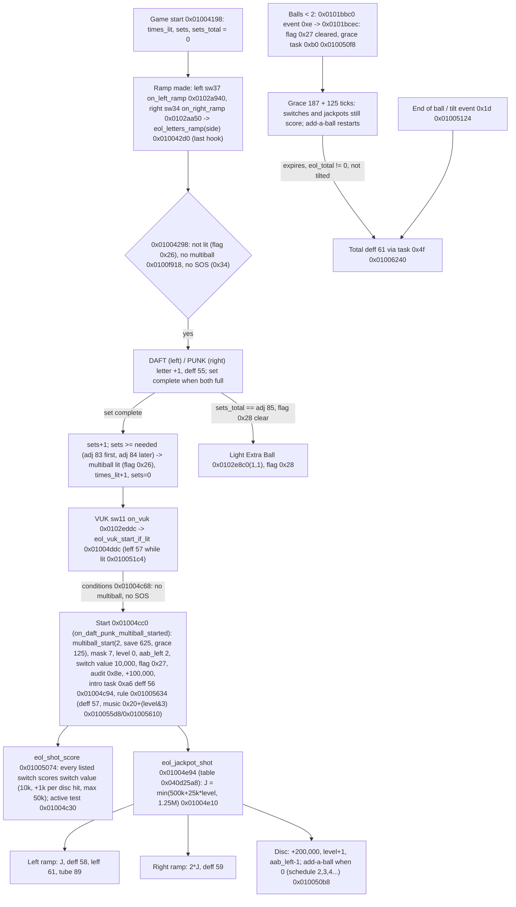

# Flow: End of Line Multiball = Daft Punk Multiball (specs `rules/modes/end_of_line_multiball.md`, `daft_punk_multiball.md`)

```mermaid
flowchart TD
  G["Game start 0x01004198: times_lit, sets, sets_total = 0"] --> LR
  LR["Ramp made: left sw37 on_left_ramp 0x0102a940, right sw34 on_right_ramp 0x0102aa50 -> eol_letters_ramp(side) 0x010042d0 (last hook)"] --> Q{"0x01004298: not lit (flag 0x26), no multiball 0x0100f918, no SOS (0x34)"}
  Q -->|"yes"| L["DAFT (left) / PUNK (right) letter +1, deff 55; set complete when both full"]
  L -->|"set complete"| S["sets+1; sets >= needed (adj 83 first, adj 84 later) -> multiball lit (flag 0x26), times_lit+1, sets=0"]
  L -->|"sets_total == adj 85, flag 0x28 clear"| EBL["Light Extra Ball 0x0102e8c0(1,1), flag 0x28"]
  S --> VK["VUK sw11 on_vuk 0x0102eddc -> eol_vuk_start_if_lit 0x01004ddc (leff 57 while lit 0x010051c4)"]
  VK -->|"conditions 0x01004c68: no multiball, no SOS"| ST["Start 0x01004cc0 (on_daft_punk_multiball_started): multiball_start(2, save 625, grace 125), mask 7, level 0, aab_left 2, switch value 10,000, flag 0x27, audit 0x8e, +100,000,<br/>intro task 0xa6 deff 56 0x01004c94, rule 0x01005634 (deff 57, music 0x20+(level&3) 0x010055d8/0x01005610)"]
  ST --> SV["eol_shot_score 0x01005074: every listed switch scores switch value (10k, +1k per disc hit, max 50k); active test 0x01004c30"]
  ST --> JS["eol_jackpot_shot 0x01004e94 (table 0x040d25a8): J = min(500k+25k*level, 1.25M) 0x01004e10"]
  JS --> LJ["Left ramp: J, deff 58, leff 61, tube 89"]
  JS --> RJ["Right ramp: 2*J, deff 59"]
  JS --> DJ["Disc: +200,000, level+1, aab_left-1; add-a-ball when 0 (schedule 2,3,4...) 0x010050b8"]
  EN["Balls < 2: 0x0101bbc0 event 0xe -> 0x0101bcec: flag 0x27 cleared, grace task 0xb0 0x010050f8"] --> GR["Grace 187 + 125 ticks: switches and jackpots still score; add-a-ball restarts"]
  GR -->|"expires, eol_total != 0, not tilted"| TOT["Total deff 61 via task 0x4f 0x01006240"]
  EB["End of ball / tilt event 0x1d 0x01005124"] --> TOT
```
