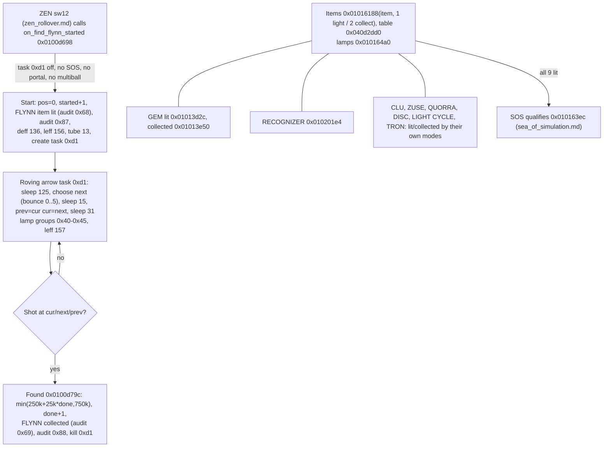

# Flow: Find Flynn and the wizard items (spec `rules/modes/find_flynn_and_items.md`)

```mermaid
flowchart TD
  Z["ZEN sw12 (zen_rollover.md) calls on_find_flynn_started 0x0100d698"] -->|"task 0xd1 off, no SOS, no portal, no multiball"| S["Start: pos=0, started+1, FLYNN item lit (audit 0x68), audit 0x87,<br/>deff 136, leff 156, tube 13, create task 0xd1"]
  S --> R["Roving arrow task 0xd1: sleep 125, choose next (bounce 0..5), sleep 15, prev=cur cur=next, sleep 31<br/>lamp groups 0x40-0x45, leff 157"]
  R --> H{"Shot at cur/next/prev?"}
  H -->|"yes"| F["Found 0x0100d79c: min(250k+25k*done,750k), done+1,<br/>FLYNN collected (audit 0x69), audit 0x88, kill 0xd1"]
  H -->|"no"| R
  IT["Items 0x01016188(item, 1 light / 2 collect), table 0x040d2dd0<br/>lamps 0x010164a0"] --- L1["GEM lit 0x01013d2c, collected 0x01013e50"]
  IT --- L2["RECOGNIZER 0x010201e4"]
  IT --- L3["CLU, ZUSE, QUORRA, DISC, LIGHT CYCLE, TRON: lit/collected by their own modes"]
  IT -->|"all 9 lit"| Q["SOS qualifies 0x010163ec (sea_of_simulation.md)"]
```
