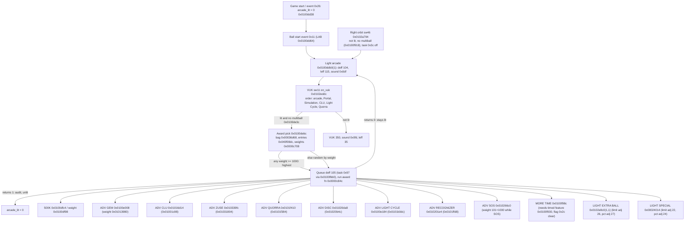

# Flow: Flynn's Arcade award (spec `rules/modes/flynns_arcade.md`)

```mermaid
flowchart TD
  G["Game start / event 0x26: arcade_lit = 0<br/>0x0100dd38"] --> NB
  NB["Ball start event 0x11 (LAB 0x0100dd64)"] --> LIT["Light arcade 0x0100ddb0(1): deff 104, leff 115, sound 0x0df"]
  RO["Right orbit sw46 0x0102a794<br/>not lit, no multiball (0x0100f918), task 0x3c off"] --> LIT
  LIT --> V["VUK sw11 on_vuk 0x0102eddc<br/>order: arcade, Portal, Simulation, CLU, Light Cycle, Quorra"]
  V -->|"lit and no multiball 0x0100de3c"| PK["Award pick 0x0100debc<br/>bag 0x00036d68, entries 0x040f08dc, weights 0x0000c708"]
  V -->|"not lit"| N350["VUK 350, sound 0x0fd, leff 35"]
  PK -->|"any weight >= 1000: highest"| AWD
  PK -->|"else random by weight"| AWD["Queue deff 105 (task 0x97 via 0x0100fbb0), run award fn 0x0000c84c"]
  AWD -->|"returns 0: stays lit"| LIT
  AWD -->|"returns 1: audit, unlit"| DONE["arcade_lit = 0"]
  AWD --> A1["500K 0x0100dfc4 / weight 0x0100df98"]
  AWD --> A2["ADV GEM 0x0100e008 (weight 0x01013980)"]
  AWD --> A3["ADV CLU 0x01016d14 (0x01001c98)"]
  AWD --> A4["ADV ZUSE 0x010339fc (0x01031804)"]
  AWD --> A5["ADV QUORRA 0x0101f410 (0x0101f384)"]
  AWD --> A6["ADV DISC 0x01020da8 (0x01020b4c)"]
  AWD --> A7["ADV LIGHT CYCLE 0x0100e184 (0x0101b0dc)"]
  AWD --> A8["ADV RECOGNIZER 0x010201e4 (0x0101ffd8)"]
  AWD --> A9["ADV SOS 0x010266c0 (weight 101+1000 while SOS)"]
  AWD --> A10["MORE TIME 0x0100f98c (needs timed feature 0x0100f930, flag 0x2c clear)"]
  AWD --> A11["LIGHT EXTRA BALL 0x0102e8c0(1,1) (limit adj 26, pct adj 27)"]
  AWD --> A12["LIGHT SPECIAL 0x00024014 (limit adj 22, pct adj 24)"]
```
