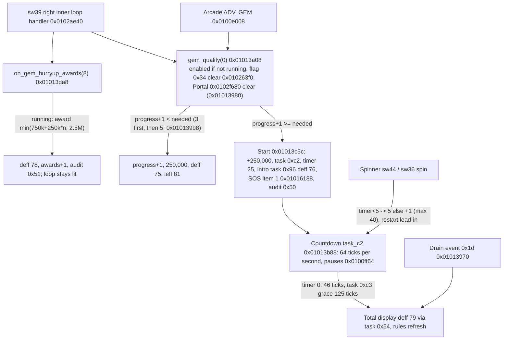

# Flow: GEM hurry-up "FOLLOW GEM" (spec `rules/modes/gem_hurryup.md`)

```mermaid
flowchart TD
  A["sw39 right inner loop handler 0x0102ae40"] --> AW["on_gem_hurryup_awards(8) 0x01013da8"]
  A --> Q["gem_qualify(0) 0x01013a08<br/>enabled if not running, flag 0x34 clear 0x010263f0, Portal 0x0102f680 clear (0x01013980)"]
  AR["Arcade ADV. GEM 0x0100e008"] --> Q
  Q -->|"progress+1 < needed (3 first, then 5; 0x010139b8)"| Q1["progress+1, 250,000, deff 75, leff 81"]
  Q -->|"progress+1 >= needed"| ST["Start 0x01013c5c: +250,000, task 0xc2, timer 25, intro task 0x96 deff 76,<br/>SOS item 1 0x01016188, audit 0x50"]
  ST --> TK["Countdown task_c2 0x01013b88: 64 ticks per second, pauses 0x0100ff64"]
  AW -->|"running: award min(750k+250k*n, 2.5M)"| AWD["deff 78, awards+1, audit 0x51; loop stays lit"]
  SP["Spinner sw44 / sw36 spin"] -->|"timer<5 -> 5 else +1 (max 40), restart lead-in"| TK
  TK -->|"timer 0: 46 ticks, task 0xc3 grace 125 ticks"| END["Total display deff 79 via task 0x54, rules refresh"]
  D["Drain event 0x1d 0x01013970"] --> END
```
