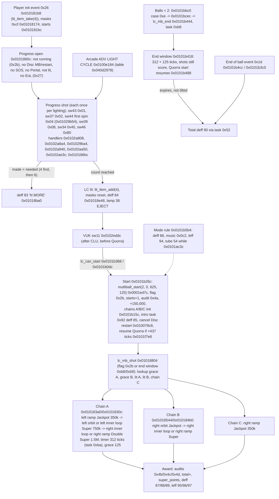

# Flow: Light Cycle Multiball (spec `rules/modes/light_cycle_multiball.md`)

```mermaid
flowchart TD
  PI["Player init event 0x26 0x010181b8 (lit_item_take(4)), masks 0xcf 0x01018174, starts 0x010181bc"] --> PR
  PR["Progress open 0x0101860c: not running (0x2b), no Disc MB/restart, no SOS, no Portal, not lit, no EoL (0x27)"] --> SHOT["Progress shot (each once per lighting): sw43 0x01, sw37 0x02, sw44 first spin 0x04 (0x01029b54), sw39 0x08, sw34 0x40, sw46 0x80<br/>handlers 0x0102a808, 0x0102a8a4, 0x01029ba4, 0x0102a940, 0x0102aa50, 0x0102ae3c; 0x010186bc"]
  AR["Arcade ADV LIGHT CYCLE 0x0100e184 (table 0x040d2978)"] --> SHOT
  SHOT -->|"made < needed (4 first, then 6)"| M["deff 83 'N MORE' 0x01018ba0"]
  SHOT -->|"count reached"| LIT["LC lit: lit_item_add(4), masks reset, deff 84 0x01018e48, lamp 38 EJECT"]
  LIT --> V["VUK sw11 0x0102eddc (after CLU, before Quorra)"]
  V -->|"lc_can_start 0x0101b368 / 0x0101b0dc"| ST["Start 0x0101b26c: multiball_start(2, 0, 625, 125) 0x0001ed7c, flag 0x2b, starts+1, audit 0x4a, +150,000,<br/>chains A/B/C init 0x0101b15c, intro task 0x92 deff 85, cancel Disc restart 0x010078c8, resume Quorra if <437 ticks 0x0101f7e8"]
  ST --> A["lc_mb_shot 0x01018804 (flag 0x2b or end window 0xb8/0xb9): lookup grace A, grace B, lit A, lit B, chain C"]
  A --> CA["Chain A 0x010183a0/0x0101830c: left ramp Jackpot 350k -> left orbit or left inner loop Super 750k -> right inner loop or right ramp Double Super 1.5M; timer 312 ticks (task 0xba), grace 125"]
  A --> CB["Chain B 0x01018544/0x010184b0: right orbit Jackpot -> right inner loop or right ramp Super"]
  A --> CC["Chain C: right ramp Jackpot 350k"]
  CA --> AW["Award: audits 0x4b/0x4c/0x4d, total+, super_points, deff 87/88/89, leff 95/96/97"]
  CB --> AW
  CC --> AW
  EN["Balls < 2: 0x0101bbc0 case 0xe -> 0x0101bcec -> lc_mb_end 0x0101b444, task 0xb8"] --> W["End window 0x0101b418: 312 + 125 ticks, shots still score, Quorra start resumes 0x0101b488"]
  W -->|"expires, not tilted"| TOT["Total deff 90 via task 0x52"]
  EB["End of ball event 0x1d 0x0101b4cc / 0x0101b3c0"] --> TOT
  RU["Mode rule 0x0101b5b4: deff 86, music 0x0c2, leff 94, tube 54 while 0x0101ac3c"] -.-> ST
```
