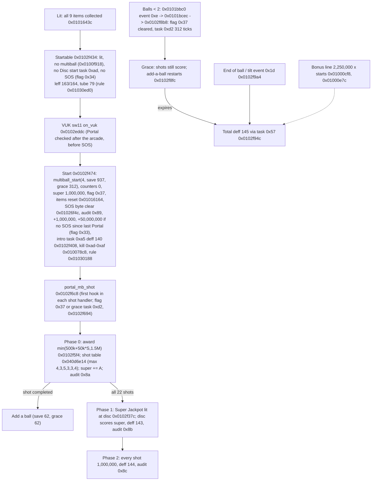

# Flow: Portal Multiball (spec `rules/modes/portal_multiball.md`)

```mermaid
flowchart TD
  IT["Lit: all 9 items collected 0x0101643c"] --> SU["Startable 0x0102f434: lit, no multiball (0x0100f918), no Disc start task 0xad, no SOS (flag 0x34)<br/>leff 163/164, tube 79 (rule 0x01030ed0)"]
  SU --> V["VUK sw11 on_vuk 0x0102eddc (Portal checked after the arcade, before SOS)"]
  V --> ST["Start 0x0102f474: multiball_start(4, save 937, grace 312), counters 0, super 1,000,000, flag 0x37, items reset 0x01016164,<br/>SOS byte clear 0x01026f4c, audit 0x89, +1,000,000, +50,000,000 if no SOS since last Portal (flag 0x33),<br/>intro task 0xa5 deff 140 0x0102f408, kill 0xad-0xaf 0x010078c8, rule 0x01030188"]
  ST --> SH["portal_mb_shot 0x0102f6c8 (first hook in each shot handler; flag 0x37 or grace task 0xd2, 0x0102f694)"]
  SH --> P0["Phase 0: award min(500k+50k*S,1.5M) 0x0102f5f4; shot table 0x040d6e14 (max 4,3,5,3,3,4); super += A; audit 0x8a"]
  P0 -->|"shot completed"| AB["Add a ball (save 62, grace 62)"]
  P0 -->|"all 22 shots"| P1["Phase 1: Super Jackpot lit at disc 0x0102f37c; disc scores super, deff 143, audit 0x8b"]
  P1 --> P2["Phase 2: every shot 1,000,000, deff 144, audit 0x8c"]
  EN["Balls < 2: 0x0101bbc0 event 0xe -> 0x0101bcec -> 0x0102f8b8: flag 0x37 cleared, task 0xd2 312 ticks"] --> GR["Grace: shots still score; add-a-ball restarts 0x0102f8fc"]
  GR -->|"expires"| TOT["Total deff 145 via task 0x57 0x0102f94c"]
  EB["End of ball / tilt event 0x1d 0x0102f9a4"] --> TOT
  BON["Bonus line 2,250,000 x starts 0x01000cf8, 0x01000e7c"] -.-> TOT
```
