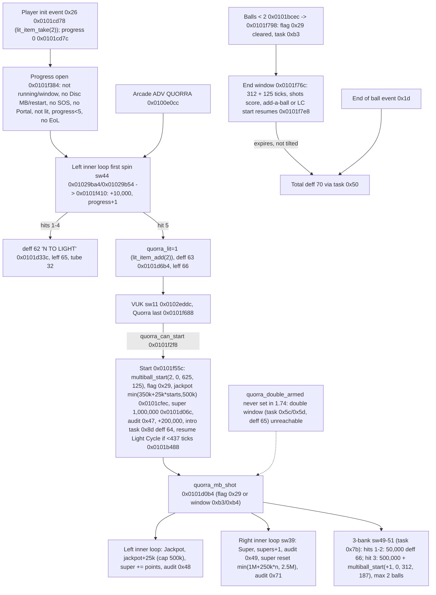

# Flow: Quorra Multiball (spec `rules/modes/quorra_multiball.md`, code 0x0101cd7c-0x0101fb1c)

```mermaid
flowchart TD
  PI["Player init event 0x26 0x0101cd78 (lit_item_take(2)); progress 0 0x0101cd7c"] --> PG
  PG["Progress open 0x0101f384: not running/window, no Disc MB/restart, no SOS, no Portal, not lit, progress<5, no EoL"] --> LS["Left inner loop first spin sw44 0x01029ba4/0x01029b54 -> 0x0101f410: +10,000, progress+1"]
  AR["Arcade ADV QUORRA 0x0100e0cc"] --> LS
  LS -->|"hits 1-4"| D62["deff 62 'N TO LIGHT' 0x0101d33c, leff 65, tube 32"]
  LS -->|"hit 5"| LIT["quorra_lit=1 (lit_item_add(2)), deff 63 0x0101d6b4, leff 66"]
  LIT --> V["VUK sw11 0x0102eddc, Quorra last 0x0101f688"]
  V -->|"quorra_can_start 0x0101f2f8"| ST["Start 0x0101f55c: multiball_start(2, 0, 625, 125), flag 0x29, jackpot min(350k+25k*starts,500k) 0x0101cfec, super 1,000,000 0x0101d06c,<br/>audit 0x47, +200,000, intro task 0x8d deff 64, resume Light Cycle if <437 ticks 0x0101b488"]
  ST --> SH["quorra_mb_shot 0x0101d0b4 (flag 0x29 or window 0xb3/0xb4)"]
  SH --> JP["Left inner loop: Jackpot, jackpot+25k (cap 500k), super += points, audit 0x48"]
  SH --> SJ["Right inner loop sw39: Super, supers+1, audit 0x49, super reset min(1M+250k*n, 2.5M), audit 0x71"]
  SH --> AB["3-bank sw49-51 (task 0x7b): hits 1-2: 50,000 deff 66; hit 3: 500,000 + multiball_start(+1, 0, 312, 187), max 2 balls"]
  EN["Balls < 2 0x0101bcec -> 0x0101f798: flag 0x29 cleared, task 0xb3"] --> W["End window 0x0101f76c: 312 + 125 ticks, shots score, add-a-ball or LC start resumes 0x0101f7e8"]
  W -->|"expires, not tilted"| TOT["Total deff 70 via task 0x50"]
  EB["End of ball event 0x1d"] --> TOT
  DEAD["quorra_double_armed never set in 1.74: double window (task 0x5c/0x5d, deff 65) unreachable"] -.-> SH
```
