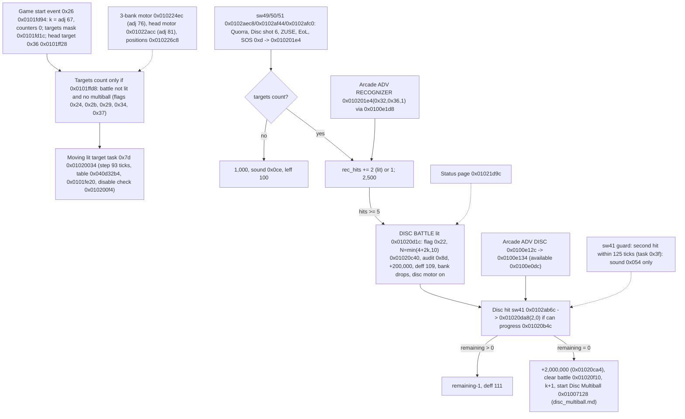

# Flow: Recognizer 3-bank and Disc Battle (spec `rules/modes/recognizer_and_disc_battle.md`)

```mermaid
flowchart TD
  G["Game start event 0x26 0x0101fd94: k = adj 67, counters 0; targets mask 0x0101fd1c; head target 0x36 0x0101ff28"] --> R
  R["Targets count only if 0x0101ffd8: battle not lit and no multiball (flags 0x24, 0x2b, 0x29, 0x34, 0x37)"] --> MT["Moving lit target task 0x7d 0x01020034 (step 93 ticks, table 0x040d32b4, 0x0101fe20, disable check 0x010200f4)"]
  SW["sw49/50/51 0x0102aec8/0x0102af44/0x0102afc0: Quorra, Disc shot 6, ZUSE, EoL, SOS 0xd -> 0x010201e4"] --> H{"targets count?"}
  H -->|"no"| H1["1,000, sound 0x0ce, leff 100"]
  H -->|"yes"| H2["rec_hits += 2 (lit) or 1; 2,500"]
  H2 -->|"hits >= 5"| DB["DISC BATTLE lit 0x01020d1c: flag 0x22, N=min(4+2k,10) 0x01020c40, audit 0x8d, +200,000, deff 109, bank drops, disc motor on"]
  AR1["Arcade ADV RECOGNIZER 0x010201e4(0x32,0x36,1) via 0x0100e1d8"] --> H2
  DB --> D["Disc hit sw41 0x0102ab6c -> 0x01020da8(2,0) if can progress 0x01020b4c"]
  AR2["Arcade ADV DISC 0x0100e12c -> 0x0100e134 (available 0x0100e0dc)"] --> D
  D -->|"remaining > 0"| D1["remaining-1, deff 111"]
  D -->|"remaining = 0"| D2["+2,000,000 (0x01020ca4), clear battle 0x01020f10, k+1, start Disc Multiball 0x01007128 (disc_multiball.md)"]
  GT["sw41 guard: second hit within 125 ticks (task 0x3f): sound 0x054 only"] -.-> D
  MOT["3-bank motor 0x010224ec (adj 76), head motor 0x01022acc (adj 81), positions 0x010226c8"] -.-> R
  ST["Status page 0x01021d9c"] -.-> DB
```
