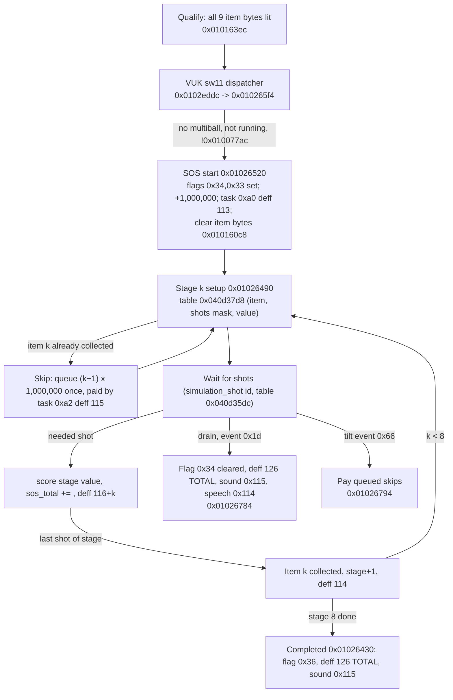

# Flow: Sea of Simulation (spec `rules/modes/sea_of_simulation.md`)

```mermaid
flowchart TD
  Q["Qualify: all 9 item bytes lit<br/>0x010163ec"] --> V["VUK sw11 dispatcher<br/>0x0102eddc -> 0x010265f4"]
  V -->|"no multiball, not running, !0x010077ac"| S["SOS start 0x01026520<br/>flags 0x34,0x33 set; +1,000,000; task 0xa0 deff 113;<br/>clear item bytes 0x010160c8"]
  S --> ST["Stage k setup 0x01026490<br/>table 0x040d37d8 (item, shots mask, value)"]
  ST -->|"item k already collected"| SK["Skip: queue (k+1) x 1,000,000 once, paid by task 0xa2 deff 115"]
  SK --> ST
  ST --> W["Wait for shots (simulation_shot id, table 0x040d35dc)"]
  W -->|"needed shot"| P["score stage value, sos_total += , deff 116+k"]
  P -->|"last shot of stage"| C["Item k collected, stage+1, deff 114"]
  C -->|"k < 8"| ST
  C -->|"stage 8 done"| D["Completed 0x01026430: flag 0x36, deff 126 TOTAL, sound 0x115"]
  W -->|"drain, event 0x1d"| E["Flag 0x34 cleared, deff 126 TOTAL, sound 0x115, speech 0x114<br/>0x01026784"]
  W -->|"tilt event 0x66"| T["Pay queued skips<br/>0x01026794"]
```
