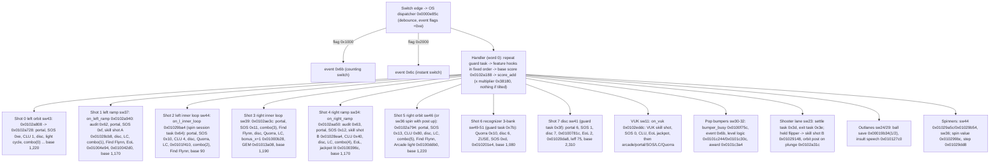

# Flow: switches and shots (spec `rules/modes/switches_and_shots.md`)

Switch descriptor table 0x040f3574 (32 bytes per switch), dispatcher 0x0000e85c, validity 0x00010c70.

```mermaid
flowchart TD
  SW["Switch edge -> OS dispatcher 0x0000e85c (debounce, event flags +0xe)"] -->|"flag 0x1000"| E6B["event 0x6b (counting switch)"]
  SW -->|"flag 0x2000"| E6C["event 0x6c (instant switch)"]
  SW --> H["Handler (word 0): repeat guard task -> feature hooks in fixed order -> base score 0x0102a188 -> score_add (x multiplier 0x38180, nothing if tilted)"]
  H --> S0["Shot 0 left orbit sw43: 0x0102a808 -> 0x0102a728: portal, SOS 0xe, CLU 1, disc, light cycle, combo(0) ... base 1,220"]
  H --> S1["Shot 1 left ramp sw37: on_left_ramp 0x0102a940: audit 0x62, portal, SOS 0xf, skill shot A 0x01028cb8, disc, LC, combo(1), Find Flynn, EoL 0x01004e94, 0x010042d0, base 1,170"]
  H --> S2["Shot 2 left inner loop sw44: on_l_inner_loop 0x01029ba4 (spin session task 0x64): portal, SOS 0x10, CLU 4, disc, Quorra, LC, 0x0101f410, combo(2), Find Flynn; base 90"]
  H --> S3["Shot 3 right inner loop sw39: 0x0102ae3c: portal, SOS 0x11, combo(3), Find Flynn, disc, Quorra, LC, bonus_x+1 0x01000b28, GEM 0x01013a08, base 1,190"]
  H --> S4["Shot 4 right ramp sw34: on_right_ramp 0x0102aa50: audit 0x63, portal, SOS 0x12, skill shot B 0x01028ea4, CLU 0x40, disc, LC, combo(4), EoL, jackpot lit 0x0100396c, base 1,170"]
  H --> S5["Shot 5 right orbit sw46 (or sw36 spin with post up): 0x0102a794: portal, SOS 0x13, CLU 0x80, disc, LC, combo(5), Find Flynn, Arcade light 0x0100ddb0, base 1,220"]
  H --> S6["Shot 6 recognizer 3-bank sw49-51 (guard task 0x7b): Quorra 0x10, disc 6, ZUSE, SOS 0xd, 0x010201e4, base 1,080"]
  H --> S7["Shot 7 disc sw41 (guard task 0x3f): portal 6, SOS 1, disc 7, 0x0100781c, EoL 2, 0x01020da8, leff 75, base 2,310"]
  H --> VK["VUK sw11: on_vuk 0x0102eddc: VUK skill shot, SOS 0, CLU, EoL jackpot, then arcade/portal/SOS/LC/Quorra"]
  H --> PB["Pop bumpers sw30-32: bumper_busy 0x0100f75c, event 0x6b, level logic 0x0101c244/0x0101c30c, award 0x0101c3a4"]
  H --> SH["Shooter lane sw23: settle task 0x3d, exit task 0x3e; held flipper -> skill shot B 0x01029148, orbit post on plunge 0x0102a31c"]
  H --> OU["Outlanes sw24/29: ball save 0x00019b34(1/2), insult speech 0x010127c0"]
  H --> SP["Spinners: sw44 0x01029a5c/0x01029b54, sw36; spin value 0x010299bc, step 0x01029dd8"]
```
