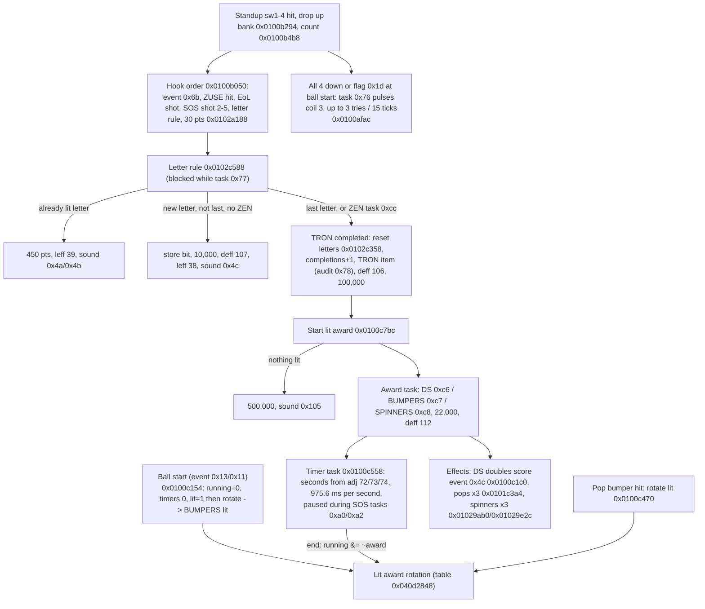

# Flow: TRON targets and timed awards (spec `rules/modes/tron_targets.md`)

```mermaid
flowchart TD
  B["Ball start (event 0x13/0x11)<br/>0x0100c154: running=0, timers 0, lit=1 then rotate -> BUMPERS lit"] --> L
  SW["Standup sw1-4 hit, drop up<br/>bank 0x0100b294, count 0x0100b4b8"] --> HK["Hook order 0x0100b050:<br/>event 0x6b, ZUSE hit, EoL shot, SOS shot 2-5, letter rule, 30 pts 0x0102a188"]
  HK --> R["Letter rule 0x0102c588 (blocked while task 0x77)"]
  R -->|"already lit letter"| R1["450 pts, leff 39, sound 0x4a/0x4b"]
  R -->|"new letter, not last, no ZEN"| R2["store bit, 10,000, deff 107, leff 38, sound 0x4c"]
  R -->|"last letter, or ZEN task 0xcc"| TC["TRON completed: reset letters 0x0102c358,<br/>completions+1, TRON item (audit 0x78), deff 106, 100,000"]
  TC --> SA["Start lit award 0x0100c7bc"]
  SA -->|"nothing lit"| N500["500,000, sound 0x105"]
  SA --> AW["Award task: DS 0xc6 / BUMPERS 0xc7 / SPINNERS 0xc8, 22,000, deff 112"]
  AW --> TM["Timer task 0x0100c558: seconds from adj 72/73/74, 975.6 ms per second,<br/>paused during SOS tasks 0xa0/0xa2"]
  AW --> EF["Effects: DS doubles score event 0x4c 0x0100c1c0, pops x3 0x0101c3a4, spinners x3 0x01029ab0/0x01029e2c"]
  TM -->|"end: running &= ~award"| L["Lit award rotation (table 0x040d2848)"]
  POP["Pop bumper hit: rotate lit 0x0100c470"] --> L
  BK["All 4 down or flag 0x1d at ball start: task 0x76 pulses coil 3, up to 3 tries / 15 ticks<br/>0x0100afac"]
  SW --> BK
```
