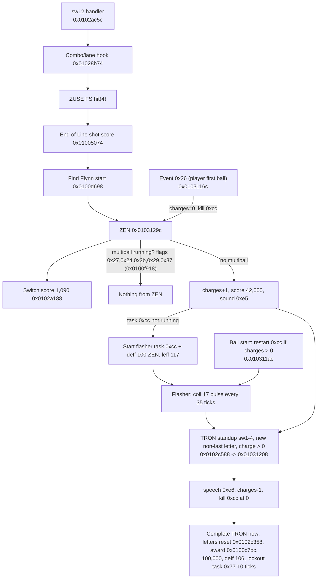

# Flow: ZEN rollover sw12 (spec `rules/modes/zen_rollover.md`)

```mermaid
flowchart TD
  H["sw12 handler<br/>0x0102ac5c"] --> H1["Combo/lane hook 0x01028b74"] --> H2["ZUSE FS hit(4)"] --> H3["End of Line shot score 0x01005074"] --> H4["Find Flynn start 0x0100d698"] --> Z["ZEN 0x0103129c"] --> H6["Switch score 1,090 0x0102a188"]
  Z -->|"multiball running? flags 0x27,0x24,0x2b,0x29,0x37 (0x0100f918)"| N["Nothing from ZEN"]
  Z -->|"no multiball"| Z1["charges+1, score 42,000, sound 0xe5"]
  Z1 -->|"task 0xcc not running"| Z2["Start flasher task 0xcc + deff 100 ZEN, leff 117"]
  Z2 --> F["Flasher: coil 17 pulse every 35 ticks"]
  F --> U
  Z1 --> U["TRON standup sw1-4, new non-last letter, charge > 0<br/>0x0102c588 -> 0x01031208"]
  U --> U1["speech 0xe6, charges-1, kill 0xcc at 0"]
  U1 --> U2["Complete TRON now: letters reset 0x0102c358, award 0x0100c7bc,<br/>100,000, deff 106, lockout task 0x77 10 ticks"]
  BS["Ball start: restart 0xcc if charges > 0<br/>0x010311ac"] --> F
  P["Event 0x26 (player first ball)<br/>0x0103116c"] -->|"charges=0, kill 0xcc"| Z
```
