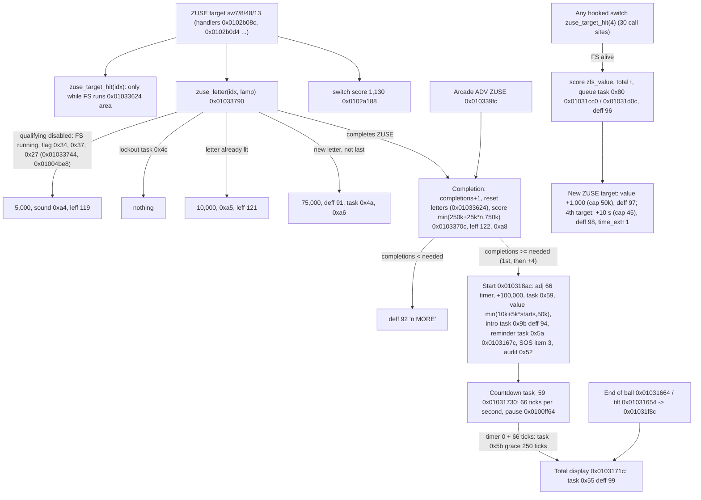

# Flow: ZUSE targets and Fast Scoring (spec `rules/modes/zuse_fast_scoring.md`)

```mermaid
flowchart TD
  T["ZUSE target sw7/8/48/13 (handlers 0x0102b08c, 0x0102b0d4 ...)"] --> ZH["zuse_target_hit(idx): only while FS runs 0x01033624 area"]
  T --> ZL["zuse_letter(idx, lamp) 0x01033790"]
  T --> BS["switch score 1,130 0x0102a188"]
  ZL -->|"qualifying disabled: FS running, flag 0x34, 0x37, 0x27 (0x01033744, 0x01004be8)"| Z5["5,000, sound 0xa4, leff 119"]
  ZL -->|"lockout task 0x4c"| NO["nothing"]
  ZL -->|"letter already lit"| Z10["10,000, 0xa5, leff 121"]
  ZL -->|"new letter, not last"| Z75["75,000, deff 91, task 0x4a, 0xa6"]
  ZL -->|"completes ZUSE"| CP["Completion: completions+1, reset letters (0x01033624), score min(250k+25k*n,750k) 0x0103370c, leff 122, 0xa8"]
  AR["Arcade ADV ZUSE 0x010339fc"] --> CP
  CP -->|"completions < needed"| M["deff 92 'n MORE'"]
  CP -->|"completions >= needed (1st, then +4)"| ST["Start 0x010318ac: adj 66 timer, +100,000, task 0x59, value min(10k+5k*starts,50k),<br/>intro task 0x9b deff 94, reminder task 0x5a 0x0103167c, SOS item 3, audit 0x52"]
  ST --> CD["Countdown task_59 0x01031730: 66 ticks per second, pause 0x0100ff64"]
  H["Any hooked switch zuse_target_hit(4) (30 call sites)"] -->|"FS alive"| SC["score zfs_value, total+, queue task 0x80 0x01031cc0 / 0x01031d0c, deff 96"]
  SC --> NT["New ZUSE target: value +1,000 (cap 50k), deff 97; 4th target: +10 s (cap 45), deff 98, time_ext+1"]
  CD -->|"timer 0 + 66 ticks: task 0x5b grace 250 ticks"| END["Total display 0x0103171c: task 0x55 deff 99"]
  EB["End of ball 0x01031664 / tilt 0x01031654 -> 0x01031f8c"] --> END
```
